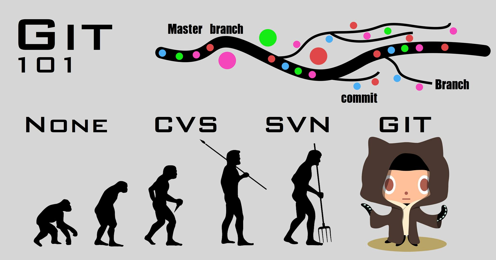

---
title       : Git 101
subtitle    : Git & Git Workflow
author      : Ben
job         : 
framework   : io2012        # {io2012, html5slides, shower, dzslides, ...}
highlighter : highlight.js
hitheme     : zenburn
widgets     : [mathjax]            # {mathjax, quiz, bootstrap}
mode        : selfcontained # {standalone, draft}
knit        : slidify::knit2slides
---  
</img>

--- .segue .dark

## 2012 COSCUP

--- .segue .dark

## Github

--- .segue .dark

## Git

--- .segue .dark

## Git? Github?

--- .segue .dark

## Git是版本控制的工具

--- .segue .dark

## Github是Git衍生的網路平台

--- .segue .dark

## 版本控制

--- .segue .dark

## 分享自己的作品

--- .segue .dark

## 跟夥伴一起協作

--- .segue .dark

## 向世界各地的大師學習

--- .segue .dark

## 這種好東西怎麼可以只有我會

--- .segue .dark

## 所以重金禮聘了強者

--- &vcenter .largecontent

## 朱鴻宇(Casear Chu)

</img>

--- .segue .dark

## 招式篇

--- .segue .dark

## 內功篇

--- .segue .dark

## 陣法篇- 圍攻光明頂

--- .segue .dark

## 紅包錢

--- .segue .dark

## 打麻將贏來的錢

--- .segue .dark

## 大樂透、威力彩、大福彩的彩金

--- .segue .dark

## 拿來報名Git 101吧！

--- &vcenter .largement

## 報名網站

- 正式課程
  - http://datasci.kktix.cc/events/git101-201603
  
- 課程說明會
  - http://datasci.kktix.cc/events/gitinfo-201601

